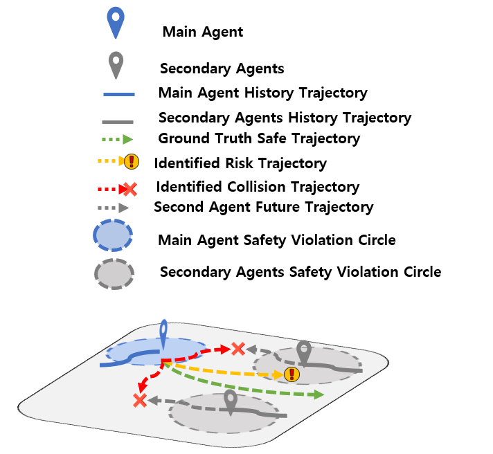
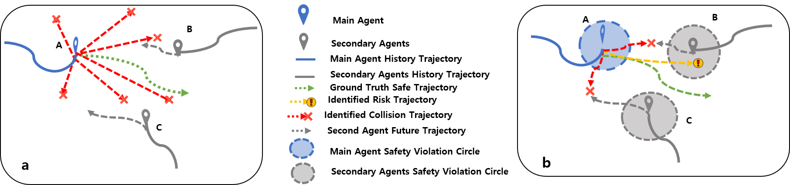
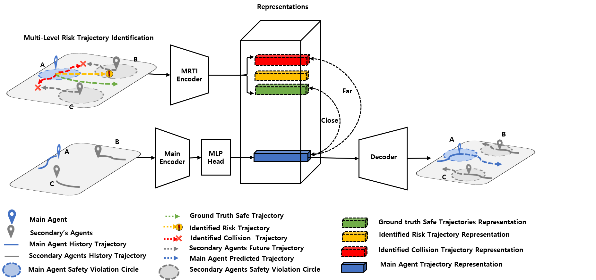
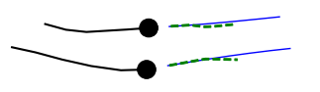
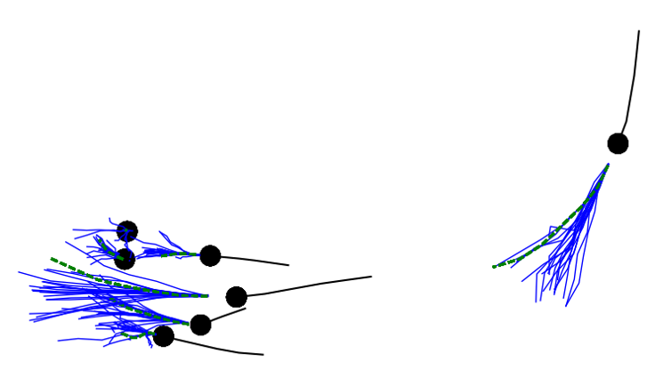
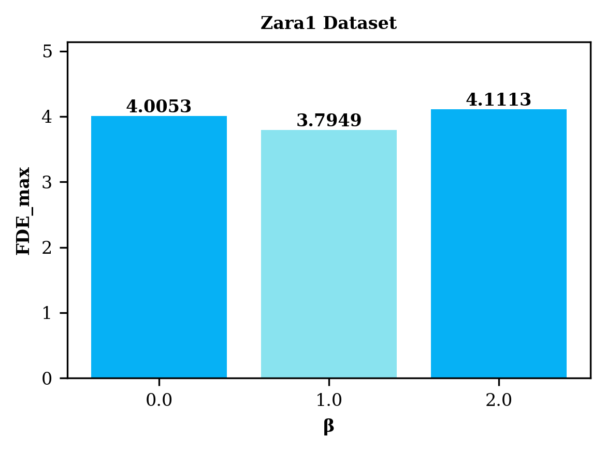
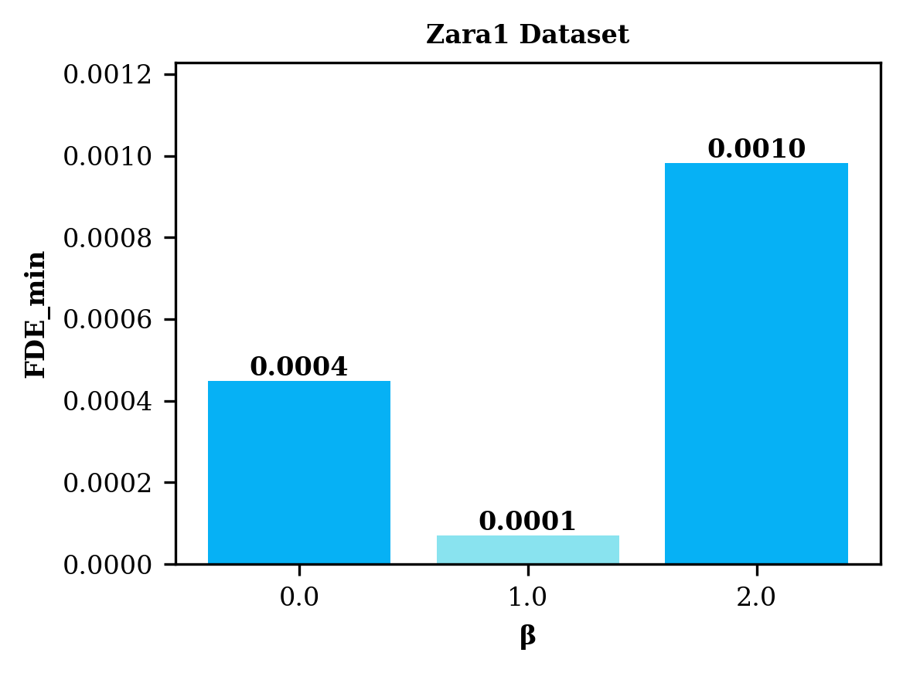
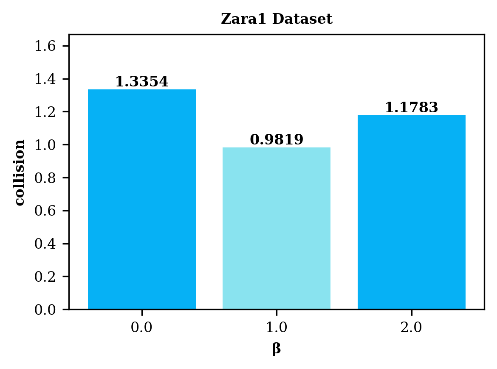

# Safety-aware Trajectory Prediction through Multi-level Risk Identification and Contrastive Learning
## Abstract
Ensuring safe trajectory prediction is critical for autonomous systems navigating in multi-agent environments, particularly for vulnerable road users such as pedestrians. While contrastive learning has shown strong potential for robust representation learning, most traditional approaches lack explicit safety constraint modeling or rely on simple binary distinctions between positive and negative samples. We propose a safety-aware trajectory prediction framework that integrates Multi-level Risk Trajectory Identification (MRTI) and Safety-aware Noise Contrastive Estimation (SaNCE) to incorporate nuanced safety awareness into the learning process. Unlike prior methods that treat all non-ground-truth trajectories as equally negative, our MRTI strategy dynamically generates hierarchically categorized trajectories, Safe, Risk, and Collision, during training. These are utilized within SaNCE to enforce a structured embedding space. By systematically identifying potential collision scenarios and enforcing safe distances, our framework improves the ability to distinguish among safe maneuvers, near-miss risks, and catastrophic collisions. We evaluated our framework on the standard ETH/UCY pedestrian benchmark. Our method achieves a mean Average Displacement Error (ADE) of 0.22 m and a Final Displacement Error (FDE) of 0.41 m, representing a reduction of over 29% compared to traditional baselines like Trajectron++. Furthermore, our framework reached a collision rate of 0.86%, which is significantly lower than existing state-of-the-art models, including recent Transformer-based architectures. These results validate that explicitly integrating MRTI and SaNCE leads to more accurate and reliable trajectory predictions for multi-agent systems.

## Methodology
6
9  ,m,
*Figure 1: An overview of our Safety-aware Trajectory Prediction framework. The system processes past trajectories to encode a safety-aware representation, guided by the MRTI module, which dynamically identifies potential future risks.*

### MRTI

*Figure 2: Comparison of sampling strategies. (a) Conventional random sampling draws negative trajectories homogeneously scattered in space, providing little information about safety boundaries. (b) Our Multi-level Risk Trajectory Identification (MRTI) systematically targets the boundaries of safety, identifying specific Risk and Collision zones to inform the contrastive loss.*

### Framework Architecture

*Figure 3: Safety-aware Trajectory Prediction through Multi-level Risk Trajectory Identification and Contrastive Learning. We guarantee safety through Safety-aware Noise Contrastive Estimation (SaNCE), and Multi-level Risk Trajectory Identification (MRTI) in the interactions of agents in multiple scenes.*

## Qualitative Results


*Figure 4: Visualization of predicted trajectory during training. The model quickly converges to physically plausible paths.*


*Figure 5: Qualitative results in a crowded scenario. The model (blue) successfully predicts a trajectory that avoids the intersecting path of a neighbor, maintaining the safety radius defined in MRTI.*

## Quantitative Results


*Figure 6: FDE_max results in meters obtained by applying different beta values (0.0, 1.0, 2.0). The results are reported for Zara1 dataset. Lower values indicate better performance.*


*Figure 7: FDE_min results in meters obtained by applying different beta values (0.0, 1.0, 2.0). The results are reported for Zara1 dataset. Lower values are better.*


*Figure 8: Collision Rate in percentage(%) when applying different beta values (0.0, 1.0, 2.0). The results are reported for Zara1 dataset. Lower values indicate better performance.*

## Getting Started

### Prerequisites

- Python 3.8+
- PyTorch
- Other dependencies can be installed from `requierement.txt`:
  ```bash
  pip install -r requierement.txt
  ```

### Training

To train the model, run the main script:

```bash
python benchmark.py
```

## Citation

If you use this work, please cite the original paper.
```
@article{bassole2026safety,
  title={Safety-aware Trajectory Prediction through Multi-level Risk Identification and Contrastive Learning},
  author={Bassole, Yipene Cedric Francois and Sung, Yunsick},
  journal={arXiv preprint arXiv:xxxx.xxxxx},
  year={2026}
}
```
